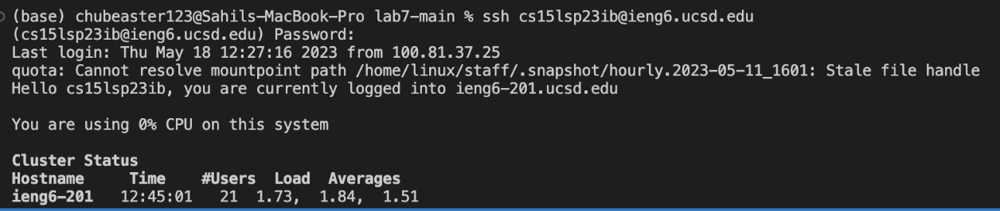
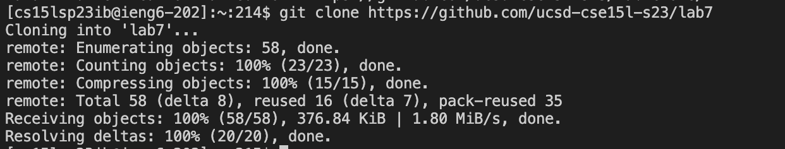
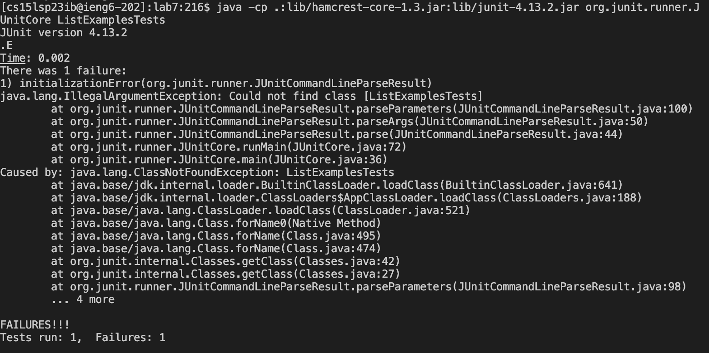
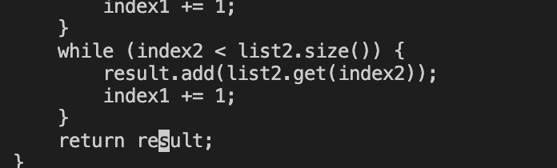
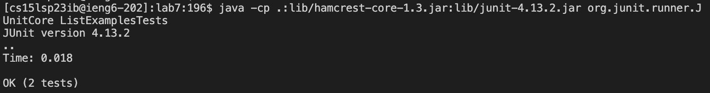
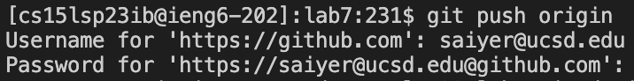

# Lab 4 Report

### Step 1
Log into your ieng6 account by typing `$ ssh cs15lsp23zz@ieng6.ucsd.edu`. Replace the zz with your specific account letters than hit `<enter>`.

### Step 2
To clone the fork of the repository copy and paste this into terminal `$ git clone https://github.com/ucsd-cse15l-s23/lab7 <enter>`.
It says in the image I already created one before I took a screenshot.

### Step 3
In terminal type `cd lab7` and hit `<enter>`. Than paste this, `java -cp .:lib/hamcrest-core-1.3.jar:lib/junit-4.13.2.jar org.junit.runner.JUnitCore ListExamplesTests <enter>`
It should say there is one failure, so to fix this we need to open up the code in vim.

 
### Step 4 
To open up vim type `vim listexamples.java` and hit `<enter>`.
Press the key `<J>` until you get to line 44 which is where the error is. 
Press the key `<L>` 12 times then press `<i>` once. Click `<delete>`, and then click `<2>` hit `<esc>` to go back to normal mode.
Finally save the changes we made by typing
`:wq! <enter>`. 

  
### Step 5
Now to test our changes we can reenter the code we inputed before, but we first need to recompile our file.
To do this type `javac ListExamples.java <enter>` in terminal. 
Now we can enter `java -cp .:lib/hamcrest-core-1.3.jar:lib/junit-4.13.2.jar org.junit.runner.JUnitCore ListExamplesTests <enter>`.
Now it should display that there are no errors in the code. 

### Step 6
To commit and push your saved changes to Github type in terminal `git push origin` and then hit `<enter>`. It will ask you for your
username and password so type those out. 

  

